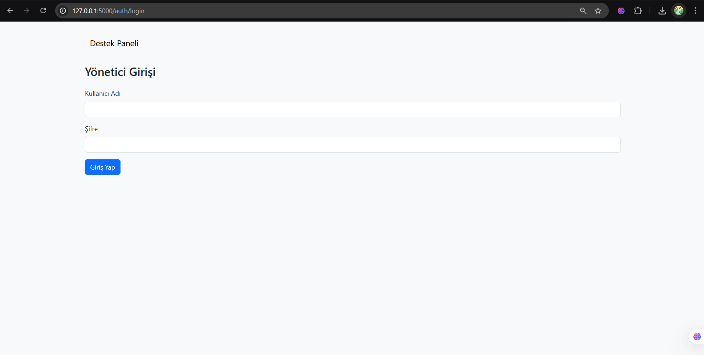
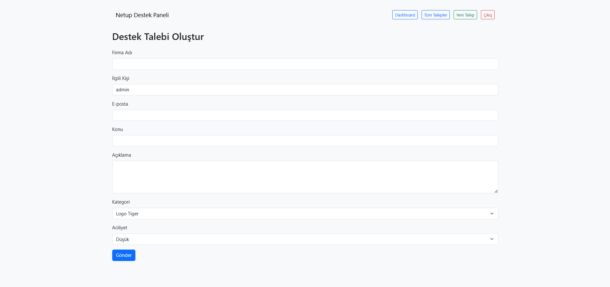
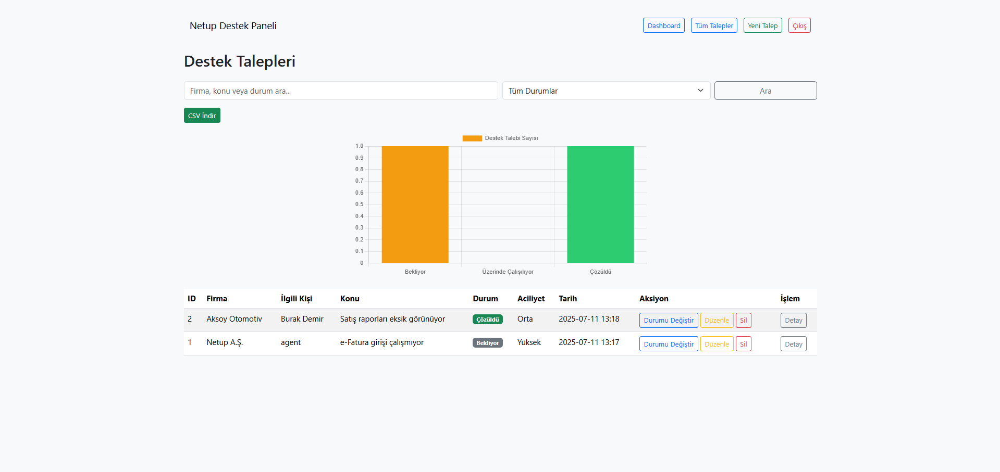
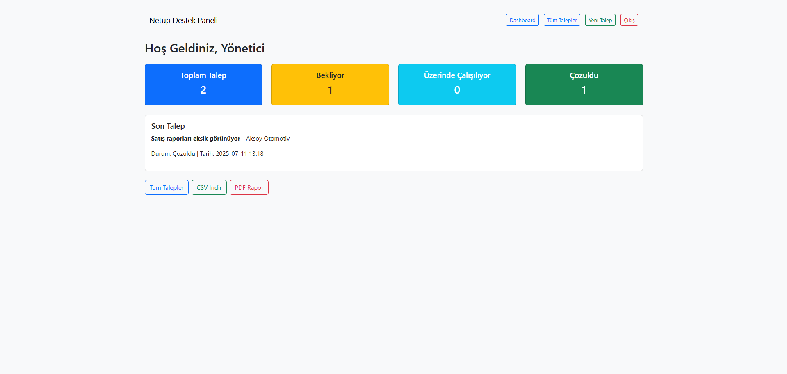
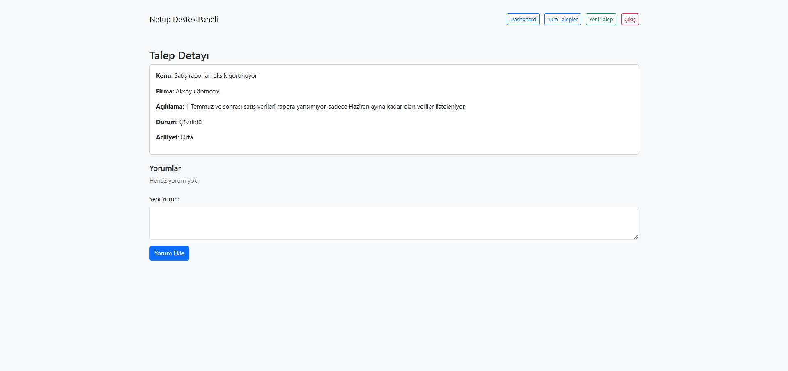

# NetUP Destek Takip Sistemi

NetUP ERP Destek Takip Sistemi, müşteri destek taleplerini kayıt altına almak, yönetmek, filtrelemek, görselleştirmek ve raporlamak amacıyla geliştirilmiş modern bir web uygulamasıdır.

## 🚀 Özellikler

- 🔐 Rol Tabanlı Giriş Sistemi (Admin / Agent)
- 📝 Yeni destek talebi oluşturma (agent ve admin)
- 📋 Tüm talepleri listeleme (sadece admin)
- 🔎 Arama ve durum filtreleme (başlık, firma, durum)
- 🧭 Mini Dashboard (istatistik kartları + son talep)
- 📊 Grafik ile talepleri görselleştirme (Chart.js)
- 💬 Yorum (not) ekleme sistemi (admin & agent)
- 📁 CSV ve PDF çıktısı alma (filtreli veri dahil)
- 🔁 Durum güncelleme, düzenleme, silme (admin için)
- 👤 Agent’lar sadece kendi taleplerini silebilir
- 🧱 Jinja2 + `base.html` ile şablon mirası
- 💡 Bootstrap 5 ile responsive modern arayüz

## 👥 Giriş Bilgileri (Demo)

| Rol     | Kullanıcı Adı | Şifre       |
|---------|----------------|-------------|
| Admin   | `admin`        | `admin123`  |
| Agent   | `agent`        | `agent123`  |

## ⚙️ Kullanılan Teknolojiler

- Python 3 + Flask
- Flask-Login, Flask-Migrate, SQLAlchemy
- SQLite (geliştirme ortamında)
- Bootstrap 5, Chart.js
- PDFKit + wkhtmltopdf

## 🧪 Kurulum

```bash
# Projeyi klonla
git clone https://github.com/m-atalar/netup-ticket-system.git
cd netup-ticket-system

# Sanal ortam oluştur ve etkinleştir
python -m venv venv
venv\Scripts\activate   # (Linux/macOS: source venv/bin/activate)

# Gerekli paketleri yükle
pip install -r requirements.txt

# Veritabanını başlat
flask db init
flask db migrate -m "Initial migration"
flask db upgrade

# Python terminaline gir
python
# Aşağıdaki komutları sırasıyla gir (kullanıcı oluşturmak için)
from app import create_app, db
from app.models import User
from flask_bcrypt import Bcrypt

app = create_app()
app.app_context().push()
bcrypt = Bcrypt()

admin = User(username="admin", password_hash=bcrypt.generate_password_hash("admin123").decode('utf-8'), role="admin", email="admin@example.com")
agent = User(username="agent", password_hash=bcrypt.generate_password_hash("agent123").decode('utf-8'), role="agent", email="agent@example.com")

db.session.add_all([admin, agent])
db.session.commit()
```

## 📷 Ekran Görüntüleri

### 🔐 Giriş Ekranı


### 📝 Yeni Destek Talebi Oluştur


### 📋 Tüm Destek Talepleri (Admin)


### 🧭 Admin Dashboard


### 📄 Talep Detayları ve Yorumlar



📌 Not
Bu proje bir staj sürecinde geliştirilmiştir. Gerçek bir şirkette kullanılabilecek şekilde yapılandırılmış olup, geliştirilmeye açıktır. PostgreSQL, SMTP desteği, e-posta bildirimleri gibi gelişmiş özellikler entegre edilebilir.